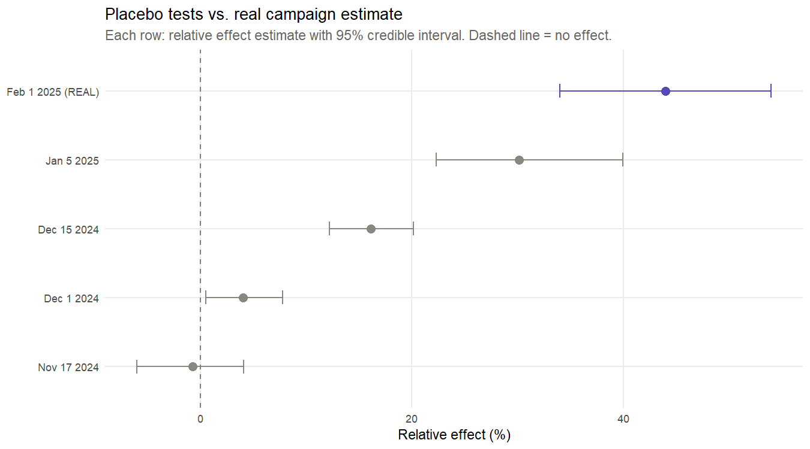

# Did Poppi's Super Bowl 2025 ad actually move the needle?

A causal inference project measuring the lift from Poppi's 2025 Super Bowl campaign on US brand search interest, using Google's CausalImpact in R.

**TL;DR:** The headline number says +44% lift. The diagnostics say don't trust it. The real story is in the day-of-game spike (about 6x baseline), and in why a brand growing this fast is genuinely hard to measure with off-the-shelf synthetic controls.

## A note on methodology

This project is a constrained exercise, not a template for how CausalImpact is typically run in practice. Two things about the setup are worth flagging before diving in.

**Google Trends is a weak KPI.** Search interest is a noisy, relative index — not a business outcome. In a real marketing measurement context, you'd want to tie the intervention to something closer to revenue: website sessions, add-to-cart events, new customer orders, or at minimum retail scan data. Search interest can move for reasons entirely unrelated to the campaign (a news cycle, a competitor stumbling, a TikTok going viral for the wrong reasons), and it doesn't tell you whether anyone actually bought anything. It's a reasonable proxy when first-party data isn't accessible, but you'd never ship a budget decision based on it alone.

**Peer-brand controls are a fallback, not the ideal.** The standard CausalImpact playbook for marketing — especially at companies like Google that developed the method — is geo-based: split markets into treated and holdout groups, expose only the treated markets to the campaign, and use the holdout as the counterfactual. Geo controls are powerful because the treated and control units share the same category dynamics, macroeconomic conditions, and seasonality by construction. You're not hoping a peer brand behaves like your brand; you're using the same brand in a different market. Peer-brand matching is what you reach for when geo holdouts aren't available — which is exactly the situation here, since a national Super Bowl buy hits every market simultaneously. It works, but it introduces the model-fit risks this project runs into directly.

## The question

Poppi ran a high-profile Super Bowl 2025 ad alongside a pre-game vending machine stunt that went viral on TikTok. Did the campaign drive a measurable lift in brand search interest, and how big?

National TV buys can't be measured with a geo holdout, since every market saw the ad. So I built a peer-brand synthetic control instead. The idea: predict what Poppi's search interest *would have been* using other beverage brands that share category dynamics but didn't run a Super Bowl spot.

## What I did

1. Pulled daily Google Trends search interest (US national) for Poppi and four peer brands from Nov 2024 through Apr 2025
2. Cleaned the data and dropped Spindrift as a control because their own product launch contaminated the series
3. Fit CausalImpact with day-of-week seasonality on Nov 1 to Jan 31 as the pre-period
4. Set the post-period as Feb 1 to Feb 23 to isolate the campaign and avoid contamination from the PepsiCo acquisition announcement on March 17
5. Validated the model with four placebo tests at fake intervention dates inside the pre-period

## The headline result

| Metric | Value |
|---|---|
| Relative lift over campaign window | **+44%** [34%, 54%] |
| Daily lift on Super Bowl Sunday | **~6x baseline** (14 to 85) |
| Cumulative search-interest gain | ~196 points over 23 days |
| Posterior probability of effect | 99.98% |

Pretty clean on its face. But.

## The placebo tests broke the headline

I ran four placebo tests by picking fake intervention Sundays inside the pre-period. If the controls were good, these should all return ~0% effect. Instead:

| Placebo date | Estimated "effect" |
|---|---|
| Nov 17, 2024 | ~0% |
| Dec 1, 2024 | +4% |
| Dec 15, 2024 | +16% |
| Jan 5, 2025 | +30% |
| **Feb 1, 2025 (real)** | **+44%** |



That's a monotonic trend. The closer the fake intervention gets to the real one, the bigger the fake "effect." Which tells me what's actually going on: Poppi was growing organically through the pre-period faster than my controls were, and the model can't separate organic growth from campaign effect when no control captures the growth.

So the +44% number isn't really "campaign lift." It's "campaign lift plus however much Poppi was already trending up that controls didn't track."

## What's actually true about the campaign

Two things, both real, telling different stories.

**The campaign-window estimate is contaminated.** The placebo trend extrapolates to roughly 35-40% even without a campaign. The model can't cleanly separate ad effect from organic momentum, so the +44% can't be defended as "what the ad did."

**The Super Bowl Sunday spike is real.** Poppi search interest jumped to about 6x its baseline on game day and decayed back over a week. No trend story explains a single-day 6x jump on a known media event. That spike is the campaign.

The honest read: the ad drove a sharp, short-lived attention burst that was clearly visible day-of-game, but the longer "campaign window" lift estimate is unreliable as a measure of incremental effect.

## Why this matters for actual marketing analytics

This is the kind of failure mode you run into constantly in marketing analytics work. CausalImpact assumes your controls track the treated brand's underlying dynamics. For a fast-growing DTC brand, off-the-shelf peer brands often don't, because they're more mature and their trajectories are flatter. The model doesn't crash. It just gives you an over-confident number.

If I were running this analysis on the inside at Poppi, I'd have access to:

- The actual marketing calendar, so placebo dates could be picked with confidence that nothing else was running
- First-party sales data instead of search proxies
- Better-matched controls like Celsius or other high-growth functional beverage brands

Without those, the right move isn't to publish a clean number with caveats buried in the appendix. It's to lead with the diagnostic finding.

## How to run it

1. Install R (4.1+) and RStudio
2. Open `poppi-causal-impact.Rproj` in RStudio
3. Install dependencies (run once):
```r
    install.packages(c("gtrendsR", "tidyr", "ggplot2", "CausalImpact"), type = "binary")
```
4. Run scripts in order from `scripts/`:
    - `01_pull_data.R`: pulls daily Trends data, saves to `data/raw/`
    - `02_explore.R`: visual exploration with all five series and event annotations
    - `03_causal_impact.R`: main model
    - `04_placebo_tests.R`: placebo validation (this is what disconfirmed the headline number)

## Project structure## Things I'd do differently with more time

- **Add high-growth controls** (Celsius, Athletic Brewing, Ghost Energy) and re-run. If placebos collapse to zero, the campaign estimate becomes defensible.
- **Restrict the post-period to 7 days** around the spot. Trend bias has less room to accumulate, and the result would lean more on the spike that's clearly real.
- **Try CausalImpact on the acquisition announcement instead.** That event has a sharper, more defined news cycle and might be a cleaner case study for the same technique.

## What I used

R 4.1, CausalImpact 1.3.0, bsts, gtrendsR, ggplot2, tidyr
